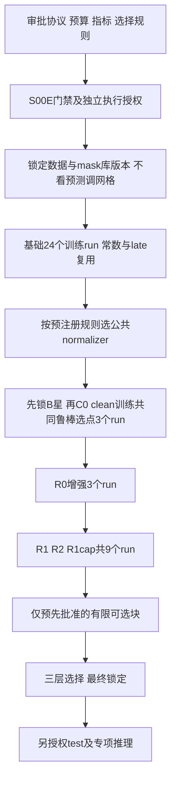

# R01 本地研究设计（FROZEN_FOR_S01_PROTOCOL：限定批准范围）

[SPECIFIED] 主研究负责人通过本轮MAIN_RESEARCH_DECISION: R01-FREEZE-01明确批准，以commit120a0938c76dd457a3d95c5c2a243f3e451a3f67为版本依据。批准的16项研究协议及原始文件SHA256登记于FREEZE_01.json；仅这些范围由PROVISIONAL变为FROZEN_FOR_S01_PROTOCOL。S01训练、official model experiment、test、附件3/4研发读取、Q3、unaligned、66-fit扩展及专项mask结论均未授权。

治理状态与证据等级分开：下文保留审批前的完整公式、论证和提案文字，不改写其历史含义。凡落在FREEZE_01.json批准项内的PROPOSED/PROVISIONAL/待审批措辞，其当前治理状态由本冻结记录覆盖；HYPOTHESIS仍只表示效果未实测。后置候选、部署结论和批准范围之外的提案不随之冻结。D-DATA-01至07保持FROZEN_FOR_BASELINE。

首轮39 fits；24/30只能执行前确定。具体resource_walltime_cap仍null，未来S01激活前须依据实际硬件及非选模资源测量填入execution config；为空禁止批量训练。附件3可靠mask availability仍UNKNOWN，natural structural-zero不自动解释为artificial missing。历史63项检查/15项独立探针及更早64/28记录不重跑、不改写；参考代码不变。

## 1. 研究对象及不变合同

[SPECIFIED; 原题正文P10、P24–31、P60–65、P73–110；DECISIONS D-DATA-01…07] Q2同时预测三类与[-3,3]强度。c=0若y<0，c=1若y=0，c=2若y>0。不能按阈值更改真值；不能删除中性/全空模态样本。只允许官方train学习、未来授权valid选择；test最终锁定评价，附件3/4只最终专项推理。本轮不打开这些数据，也不训练或smoke。

| 决定 | FROZEN_FOR_BASELINE的含义（SPECIFIED） |
|---|---|
| D-DATA-01 | aligned_50为首个受控baseline；不是优于unaligned的结论 |
| D-DATA-02 | S=(text_bert[:,1,:]==1)，三模态共享support；与observed/corruption区分 |
| D-DATA-03 | O_T=S；O_A=S∧¬Z_A；O_V=S∧¬Z_V；Z由原始整行精确结构零定义 |
| D-DATA-04 | STRUCTURAL_ZERO不自动等于natural missing、padding或artificial corruption |
| D-DATA-05 | P=¬S，所有时序汇聚/注意力汇总/时序loss排除P |
| D-DATA-06 | predictor只含连续text/audio/vision及受控mask；标签/ID/raw_text/split/token IDs/专项统计禁止进入 |
| D-DATA-07 | Identity与train-only Z-score是候选；仅train supported-and-observed fit，最终选择未冻结 |

[SPECIFIED] X^m∈R^{B×50×d_m}，d_T=768,d_A=74,d_V=35；S,O,C,A∈{0,1}^{B×50}。Z在任何归一化/损坏前确定并保存，C≤O，A=O∧¬C；不得据变换后的零值重算Z/O/C。源数组不可变。原始有效区非有限或float32转换溢出应报错；safe kernel只对active子集进行算术，不以0×NaN屏蔽。support为空违反正式合同；某模态A为空合法，返回零向量/null，不能丢样本。

[VERIFIED: 公开报告，未重新打开数据] S00D train/valid样本3395/728，support位置83672/18628；支持内audio结构零6855/1502、vision结构零11039/2436。S00C报告support外text非零86078/17772；unaligned vision声明长度之后非零36928/8455，涉及618/141个样本。分类编码已由公开标签合同核验。均为安全聚合事实，不把结构零计数称自然缺失率，不使用test分布。出处和原字节hash见来源章。

## 2. R01-REV-01：可用掩码来源与两类接口

| 变量 | 仿真train来源/可得性 | 仿真valid来源/可得性 | 最终专项推理 | 是否入student |
|---|---|---|---|---|
| S [SPECIFIED/UNKNOWN] | 原text_bert channel1，合同可得 | 同一冻结合同 | 若该channel保持可信语义才可得；尚未确认 | 受控安全元信息 |
| Z [SPECIFIED/UNKNOWN] | 未损坏原audio/vision精确零判定 | 同左 | 已损坏数据的零不能分解为原Z和人工缺失 | 不直接入；用于仿真构造O |
| O [SPECIFIED/UNKNOWN] | 原始冻结规则，text=S | 同左 | 原损坏前O一般不可恢复；text冻结规则不是专项缺失检测器 | 仿真不额外提供原O；clean A=O |
| C [HYPOTHESIS/UNKNOWN] | 生成器控制记录，明确可得 | 固定评估库控制记录 | 没有声明可信标注，未知 | 不直接输入，留控制/监督/审计 |
| A [INFERRED/UNKNOWN] | O∧¬C，已知仿真可用性 | 同左 | 需要可信mask来源或另审推断接口；未知 | 安全屏蔽及候选元信息 |
| b_m=1[ΣA_m>0] [INFERRED] | 从A派生 | 从A派生 | 可得性继承A，不能独立消除oracle依赖 | 固定接口分组内一致使用 |
| ρ_m=ΣA_m/ΣS [INFERRED] | 从A/S派生 | 从A/S派生 | 可得性继承A/S | 同上；不是原observed损坏率 |

[INFERRED] forward不显式收C，不表示无oracle依赖：输入A及其b/ρ在仿真中仍携带由已知C计算的可用性。本文明确命名“KNOWN_AVAILABILITY模拟条件”。其鲁棒曲线只能支持该条件下的结论。

[HYPOTHESIS] 接口K（已知可用mask）：forward(S,A,U)；训练/验证已知仿真A。未来只有提供者文档或经单独授权审查能确认部署时同等A可得，才可迁移该结论。

[HYPOTHESIS / REQUIRES_SEPARATE_AUTHORIZATION] 接口U（缺少可靠专项mask）：暂不部署K。候选U1为由数据提供者出具独立可信available mask及support协议；候选U2为仅从合法损坏后连续特征估计soft reliability、只以可信S做安全padding屏蔽，在train仿真中校准，整个训练/验证同步模拟无oracle条件。U2不能静默把text零行定义成missing、不能重新命名冻结O，且涉及新输入适配语义，需单独提案与审批。本轮只列接口假设，不实现/选定U2，不读取附件3补洞。

[SPECIFIED] clean baseline研究不依赖“专项损坏前O能否恢复”，因为clean附件2的S/O合同已冻结；但clean正式实验仍需要S00E门禁及新的执行授权。部署未知不使理论研究无效，也不解除执行门禁。原题允许Q1来源治理，但精确异常→missing仍未定。

## 3. R01-REV-02：完整连续局部生成器

[HYPOTHESIS] 支持前缀长度L=ΣS，合法条件g=(M,q,p)：M∈{T,A,V,TA,TV,AV}，q∈{0.1,0.3,0.5,0.7}，p∈{front,middle,back,random}，共96个名义条件。q用有理数计算，L≥2时ℓ=min(L−1,max(1,ceil(qL)))。L=1直接INELIGIBLE。

\[
\mathcal J_g=\{s\in\{0,\ldots,L-\ell\}\mid \forall m\in M,\ 0<\sum_{t=s}^{s+\ell-1}O_t^m<\sum_t O_t^m\}.
\]

[INFERRED] 先在原supported坐标枚举J，再选s；I=[s,s+ℓ)，C_t^m=1[m∈M]1[t∈I]O_t^m。窗口连续但C可因原结构零而有孔洞，不能将observed压缩排名后当真实连续时间。三模态使用同一S，不假定秒级等距。

[HYPOTHESIS] front/middle/back目标起点分别0、floor((L−ℓ)/2)、L−ℓ；在J内最小化(|s−target|,s)，因此等距选较小s。原目标不合法则记录moved、requested_start与realized_start。random在J中均匀抽一个起点。J为空明确INELIGIBLE：短support、所选模态observed≤1、或双模态无共同合法窗口分别记reason。不得缩短ℓ或换模态/标签挑窗；独立双窗口只能作为后续单独诊断，不能替代共同窗口条件。

[HYPOTHESIS] 每个train样本每epoch一个视图：0.5概率clean，否则等概率抽96条件。若抽到INELIGIBLE，该次回退C=0/A=O的clean输入，保留一次样本和权重1；不再重抽条件、不增加第二个clean副本。因回退而高于0.5的实际clean比例只记聚合诊断，不据标签调整。训练采样键只含根seed、model_seed、epoch、私有行序号和purpose；模型族/标签不入键。同model_seed的各模型共享corruption机会。

[HYPOTHESIS] valid每个样本每个条件均计入attempted全集。ELIGIBLE用对应损坏视图预测；INELIGIBLE复用该模型该checkpoint的clean预测一次，不能伪造“损坏后预测”；每个条件分母仍为完整valid样本数。另报eligible-only结果与资格率，零eligible时eligible-only=null；不删除该名义条件。以attempted为主选型量，是本轮明确修订提案，需要负责人批准，不能直接同初稿含糊的eligible平均比较。

[INFERRED] r_obs^m=ΣC_m/ΣO_m（分母0为null），r_support^m=ΣC_m/L，实际span比例ℓ/L，名义q分别记录。m不在M则C=0；无资格实际r=0或null，不能把名义q当实际缺失率。全模态消失/TAV全空仅STRESS，不进入主96条件。

[HYPOTHESIS] seed命名：model_seed={17,29,43}；train_root=2207；valid_root=1103。valid keys=("valid",1103,private_row_ordinal,condition_id,replicate)，**不含模型族、model_seed、epoch**。random replicate=0,1,2，确定位置replicate只有0，不能做3roots×3replicates。条件重复使用同一实例库；固定位置共72视图，random名义24条件×3=72视图，合计144视图/样本/seed，但96个条件权重各1/96。clean报告单列，不算第97个鲁棒条件。

[VERIFIED: SYNTHETIC_ONLY源码；INFERRED随机性质] 本参考不依赖NumPy版本：JSON紧凑ASCII编码键，SHA256(payload + '|' + counter)解释为big-endian整数；对n个候选起点用拒绝采样排除≥floor(2^256/n)n，再取mod n。代码设置1024次异常上限（hash拒绝不是改变缺失条件的重采样）；hash均匀假设下起点无模偏差。canonical group/rate/position顺序见reference.py。未来正式实现必须对同键逐项对齐，不仅声称“相同seed”。

## 4. 模型公式与R01-REV-05机制可辨识性

[INFERRED] SafeSelect后U只有A=True行参与统计；n_m=ΣA_m，p_m=Σ_{t∈A_m}U_t/n_m（n_m=0时显式零向量）。Z-score μ/σ只在train原O拟合，σ=0→scale1，统计样本数0→拒绝fit；先保留原S/O/Z，再产生C并屏蔽归一化输入。非active值不投影/平方/做softmax，active非有限报错。

[HYPOTHESIS] 轻量基线保留三单模态pool→MLP，原始pooled拼接p∈R^877→h→双头，和复用单模态模型的等概率late fusion。late只平均可用模态，无模态则用train prior/median。其预测复用不会产生新训练次数，但总部署参数与3次前向成本须报告。单隐藏层d→h→(3+1)参数为(d+5)h+4，不把等h称等容量。

[HYPOTHESIS] 为隔离机制增加固定“比较底座”C0：g_m=ReLU(W_m p_m+b_m)∈R^h（空模态显式g=0），f_eq=Σ_{m∈J}g_m/|J|，J={m:n_m>0}；head输入[f_eq,b_T,b_A,b_V,ρ_T,ρ_A,ρ_V]∈R^{h+6}。C0/R0使用相同参数形状、双头与mask信息；C0只clean训练，R0仅改变为第3节增强。R0和原始877维拼接之间存在融合与投影差异，不能把两者差值归因于增强。

[HYPOTHESIS] R1明确使用**与R0相同的等权融合f_eq与h+6双头**；只改变模态编码器为“先逐位置投影，再一层partial convolution，再masked pool”：

\[
E_t^m=\operatorname{ReLU}(W_mU_t^m+b_m)\quad(t\in A_m),\qquad
v_t^m=\operatorname{ReLU}\left(b'_m+\frac1{k_t}\sum_{\delta\in\{-1,0,1\},\ t+\delta\in A_m}K^m_\delta E^m_{t+\delta}\right),\quad t\in A_m.
\]

[INFERRED] 其余位置E/v置零；k_t是合法邻居数，active中心含δ=0所以非零；g_m=mean_{A_m}v_m。投影d_m→h，K∈R^{h×h}，时序成本约B·50·Σd_m h+B·3·50·3h²。R0→R1同时改变非线性投影位置和增加时序容量，因此主结论为“编码器包增量”，不能声称纯顺序效应；补参数匹配pool控制及固定mask的顺序置乱诊断才研究顺序作用。

[HYPOTHESIS] R2只将R1的f_eq换成gating：q_m=[g_m,b_m,ρ_m]，a_m=wᵀtanh(Vq_m+b)，α_m=softmax_{m∈J}(a_m)，f_gate=Σα_mg_m。J为空走有限train prior；禁止softmax全负无穷。主R1/R2对照固定编码器**架构、初始化种子规则、输入信息、双头、loss、增强与trial预算**，各自端到端训练。所得差异含encoder共同适应，不声称固定encoder权重的直接gate效应。若需后者另做冻结同一R1 checkpoint编码器、只fit融合/head的配对实验，列为推迟项，不能把两种“固定”混称。

[HYPOTHESIS] 必需R1-cap为同编码器、等权融合，加一个读取[g_T,g_A,g_V,b,ρ]的非门控残差MLP，补偿gate新增容量并给予相同信息。h=64、gate隐藏64时shared gate参数(h+4)h=4352；残差MLP(3h+6)→16→h参数(4h+7)·16+h=4272，差约1.84%（代数计算非实测），不以无用dummy参数“匹配”。未来核对总参数及FLOPs，不能把参数近似相等称算力相等。R2若仅胜R1而不胜R1-cap，不作gate机制有效结论。

[HYPOTHESIS] no-meta诊断只移除b/ρ作为learned gate/head的输入，必须保留S/A安全屏蔽、空模态路由与合法归约。mask-only独立小头仅看b/ρ，用于检查mask捷径，不参加最终候选排名。上述诊断不宣称与信息集完全一致的主gate对照。普通隐藏层dropout不能替代连续模态缺失。

[HYPOTHESIS] 可选后置R3为有双方可用时的g_m⊙g_n交互；R4为query/key均以A屏蔽的cross-attention，Q,K,V∈R^{B×50×h}，QKᵀ为50×50，softmax只选有效keys，无keys输出0并保留有效query残差。跨模态方向D的成本约BD(50h²+50²h)，attention memory约BD·heads·50²；复杂性不证明优越。R3/R4/KD/重建不进入第一baseline或本轮必做预算。

[HYPOTHESIS / INFERRED] z=W_ch+b_c∈R³，π=softmax z，ĉ=argmax（严格平票取最小类）；ŷ=3tanh(w_rᵀh+b_r)。联合监督每个样本及其视图等权：
\[
L_{sup}=\frac1B\sum_i\frac1{|V_i|}\sum_{v\in V_i}\{-w_{c_i}\log\pi_{iv,c_i}+\lambda_r\rho(\hat y_{iv}-y_i)\}.
\]
[HYPOTHESIS] 核心T0固定w=1、λ_r=1、ρ(e)=|e|/3；Huber_1(e)/3与train频率权重w_k=N/(3n_k)只在后置有限块中单因素比较，n_k=0拒绝加权。Huber为|e|≤1时e²/2，否则|e|−1/2。不强迫分类与回归符号一致；诊断中性阈值只作用预测，真实y=0不变。初稿λ与τ候选暂不全部搜索。

[HYPOTHESIS] 后置KD：teacher只train学习，valid可选checkpoint，不在valid蒸馏；L_KD=τ_d² KL(stopgrad softmax(z_teacher/τ_d) || softmax(z_student/τ_d))+β|ŷ_S−stopgradŷ_T|/3。teacher可错、可train过拟合，不能把软输出当真标签。必须比较λ_KD=0并计teacher完整成本。

[HYPOTHESIS / INFERRED] 后置真实observed人工损坏重建：J_C={m:ΣC_m>0}，
\[
L_{rec}=\begin{cases}\frac1{|J_C|}\sum_{m\in J_C}\frac{\sum_{i,t:C^m_{it}=1}\|R^m_{it}-\mathrm{stopgrad}(U^{m,clean}_{it})\|_1}{d_m\sum_{i,t}C^m_{it}},&J_C\ne\varnothing,\\0,&J_C=\varnothing.\end{cases}
\]
[SPECIFIED/INFERRED] C≤原O且监督target独立；不监督padding或O=False结构零，不将重建视为真实观测。标准库reference现在实际实现并测试此函数的空/非空监督、不同维度模态平均与非法C，替代初稿的sum([])==0弱检查；不涉及训练/反向传播。

## 5. R01-REV-03：三层选择协议

[SPECIFIED] 原题要求Accuracy/F1/MAE/Pearson。[HYPOTHESIS] 本研究拟议macro-F1为主、MAE次之，classes固定0/1/2；每类F1=2TP/(2TP+FP+FN)，分母0记0且保留support，附每类precision/recall、weighted-F1、完整混淆矩阵。MAE按样本平均，不无权平均batch均值。Pearson N<2或真值/预测零方差=null+原因，禁止填0。辅助Pearson按每条件/replicate原样报告并注明有效性，不平均删去null后装作全条件结果。

[HYPOTHESIS] 聚合顺序对每个指标分别进行：先对完整attempted样本计算metric（不是对预测求均值）；再同一名义条件的replicate等权平均；再96条件等权平均；最后三个model_seed等权平均。确定位置仅1重复，random3重复，每个随机重复占1/(96×3)，确定条件占1/96。同一样本反复出现不是144个独立样本。eligible-only及覆盖率并列，不偷偷代替attempted主分数；模型间必须相同样本次序和资格集。

### 5.1 单次训练：checkpoint与early stopping

[HYPOTHESIS] 核心候选max_epochs=100，patience=10个连续评价epoch，min_delta_F=1e−4，min_delta_MAE=1e−4；每epoch一次固定valid评估。B块单模态/原始拼接训练用clean(F,MAE)选checkpoint；C0/R0/R1/R2/R1-cap机制块统一用第3节attempted96网格(F,MAE)，包括只clean训练的C0。**checkpoint选择与patience计数分开**：保存至今按F最大、MAE最小的精确最佳checkpoint，完全平票保留最早epoch；微小进步可以保存，但不足min_delta不一定重置patience。min_delta是耐心重置阈值，不是将真指标四舍五入。有限指标必须检查，NaN终止。

```text
best = None; anchor = None; stale = 0
for epoch in 1..100:
    train_one_epoch_on_train_only()      # 未来授权后，当前不实现或调用
    F, M = fixed_valid_score_for_this_run()
    if best is None or (F, -M) > (best.F, -best.M):
        best = checkpoint(epoch, F, M)   # 完全平票保留更早epoch
    if anchor is None or F-anchor.F >= 0.0001 \
       or (F >= anchor.F and anchor.M-M >= 0.0001):
        anchor = (F,M); stale = 0
    else: stale += 1
    if stale >= 10: break
return best                              # 不回看已停止之后的epoch
```

[INFERRED] 主F退步时即使MAE改善也不重置patience；主F达到阈值改善可允许MAE变差，反映主次关系。最早epoch和配置ID给确定性平票规则；归约使用float64固定顺序、不先舍入。同一平台细微数值差异风险另记，不声称跨硬件逐位训练可复现。

### 5.2 跨seed配置排序

[HYPOTHESIS] 配置=架构、normalizer、loss、学习率等完整tuple；每配置三个seed各自按5.1选checkpoint，之后才平均其valid结果。禁止挑表现最好的seed。clean配置排序键=(-meanF,meanMAE,实际参数数,config_id字典序)；在B块24次拟合及其PRIOR/LATE评估完成后，从8个基础配置、2个late配置和1个prior中确定clean参考B*并封存；PRIOR无训练seed，用同一统计预测作为确定候选，可训练参数为0，3类先验与median共4个统计量另记。C0不进入B*集合，再进入共同选择规则的机制块。

[HYPOTHESIS] robust配置先以三个seed均值验证clean约束：F_clean≥F_clean(B*)−ε_F，MAE_clean≤MAE_clean(B*)+ε_M，其中ε_F=0.01、ε_M=0.05 **仍待负责人批准**。再按(-mean_attemptedF,mean_attemptedMAE,参数数,config_id)排序。没有可行候选就保留B*，不回到每个run其他checkpoint挖取clean可行“备用最佳”；这种额外搜索未获预算。需不同checkpoint策略应另行预注册。

### 5.3 最终模型与统计边界

[HYPOTHESIS] 初步提议最终部署选获胜配置的**预指定seed17** checkpoint，不因其valid成绩换seed，不对全train+valid重训。跨seed均值通过clean约束后，获胜配置的seed17还须相对B*对应seed17再次满足同一epsilon约束；失败即回退B*的seed17，不尝试其他seed或第二名配置。PRIOR视为确定性参考，LATE参考使用三个单模态的seed17组件。此固定seed保险规则为PROVISIONAL。ensemble默认不启用；若要3seed ensemble，应在运行前另审批，其预测=概率平均和强度平均，不能把“3seed指标平均”称ensemble性能。主次指标、ε、patience/min_delta、seed17及是否ensemble全部PROPOSED。

[INFERRED] 同一valid用于多epoch、配置、归一化和结构选择有乐观偏差。普通配对bootstrap只描述固定模型条件下抽样不确定性，不能消除选择偏差。未来若做区间，以合法video_id作私有cluster，同时保留片段的全部corruption重复，不能把seed×重复当独立N；标明3seed对训练随机性的估计有限。多比较另预注册校正；未运行不填显著性。最终test只在完整锁定且单独授权后一次评估；专项也不得反向调参。

## 6. R01-REV-04：有限预算与先后依赖

[HYPOTHESIS] 任何未来实验前，主负责人先批准本协议、指标/epsilon/seed/stop规则、trial表、资源上限、mask库版本；另满足S00E门禁与执行授权。之后才能基础对照。原DAG“先做基础对照再固定预算”的歧义撤回。



[HYPOTHESIS] T0固定h=64、AdamW lr=1e−3、weight_decay=1e−4、batch32、无隐藏dropout、梯度范数clip1、CE+MAE/3。T1只把lr变3e−4。normalizer公共选择预先指定看原始拼接baseline的三seed clean排序；选出Identity或Zscore后C0/R0/R1/R2/R1cap都使用同一个，不给每结构单独扩大归一化搜索。两个normalizer的train fit是预处理统计，不计模型训练run；仍需来源和hash记录。

| 块 | 有限trial定义 | 新训练run数（拟议） | 累计上限 | 必做/可选 |
|---|---|---:|---:|---|
| B | T/A/V/原始pool-concat ×2 normalizer ×T0 ×3seed | 24 | 24 | clean基线最低必做 |
| PRIOR/LATE | 常数train prior/median；复用B的同seed同normalizer单模态输出，2×3套late评估 | 0 | 24 | 必报，不能重复计3模型训练 |
| C0 | 公共normalizer ×T0 ×3seed | 3 | 27 | 做增强机制比较前必做 |
| R0 | 与C0同架构，仅加增强 ×3seed | 3 | 30 | 最低鲁棒比较 |
| R1/R2/R1cap | 三架构 ×同normalizer/T0 ×3seed | 9 | 39 | 若声称时序/门控作用则必做 |
| D | no-meta及mask-only ×T0 ×3seed | 6 | 45 | 预先批准的诊断；不当主候选 |
| T | C0/R0/R1/R2/R1cap ×T1 ×3seed；T0已经存在 | 15 | 60 | 可选且整块执行才能同预算比较 |
| L | R0+Huber替换；R0+train类权重，两者不叠加，各T0×3seed | 6 | 66 | 后置探索，不反写主机制结论 |
| DEFERRED | R3/R4、KD、重建、冻结encoder gate比较、额外h/λ/τ/ensemble/unaligned | 0 | 66 | 推迟，需新有限预算审批 |

[INFERRED] 24/30/39/66均为未来授权方案训练次数，不是已训练记录。标准机制包39；D/T/L可整块不启用（分别减少6/15/6），没有无限笛卡尔积。算力不足先停在24或30档；单seed探索不得取代三seed确认或虚报完成39档。独立窗、顺序置乱、压力图是已选checkpoint额外前向，不增加训练次数，计算预算另记录；若变成新训练则需新增trial。

[HYPOTHESIS] 可选T1块中的C0用于公平调参对照，不重新锁定原clean参考B*；clean容忍阈值始终比较最初封存的B*。如果L块只给R0调loss，其结果仅记探索性，不用不等搜索量的结果宣称R0/R1/R2机制优劣；要将其升级最终选型候选须在实验前另批对称预算，不能事后追加。

[HYPOTHESIS] 总时间只给未来估算式Σ_run(epoch_count·ceil(N_train/32)·实测step_time+各epoch固定valid144视图成本)+必要I/O，不给实测秒数猜测。实际实例参数数/显存/训练时间均null直到合法运行；文中符号参数计数是代数推导，不是实测。严格同trial预算也不等于相同FLOPs，需同时报告两者。非法split/非有限/源变更立即停；科学无增益保留负结果，不无限增加trial。

## 7. Q3接口、解释限制与未决事项

[HYPOTHESIS] 仅保留{logits,intensity,pooled,gates或null,attention或null}与provenance接口。记录S/O/C/A来源、feature/scaler/model/config hash、归因目标及baseline来源、modality、sequence_index、mapping_method/version/confidence、time_start/end或null。ID只作未来私有对应与cluster，不是predictor。未验证映射不能index/50×duration造秒；不编造74/35维物理语义。gating/attention不是因果贡献；Q3最终算法与Q1异常missing映射未决定。

[UNKNOWN] 专项A/S可得性、预计算文本上下文扩散、真实泛化/资源成本仍未知。遮局部向量不保证原语义彻底消失，结论必须限预计算特征损坏。R01研究不替代工程D2-R01。S00E已由独立工程线验收发布，本轮只读重核；其完成不是本研究的模型验证。

## 8. 本地收敛的适用结论

[PROVISIONAL / INFERRED] C0/R0现在只改变train增强策略，共用attempted96选点/早停、初始化规则及超参。相同随机种子不保证不同模块消耗随机数后仍同初始化：未来实现须按模块名+seed派生初始化种子，数据排列与corruption使用独立流。R0→R1仍只识别编码器包。R1/R2/R1-cap识别端到端融合策略差异，不等于固定表征的门控因果效应。相同规则导致不同早停epoch属于策略结果，不宣称训练步数相同。

[PROVISIONAL] 首轮推荐39训练run核心协议；24与30为缩减目标备选，须在运行前确认，不看valid结果决定继续哪个可选模型。D/T/L目前关闭，总上限若全部提前另批为66。计算资源时限未获得，不能伪填秒数或GPU小时；任一资源上限缺失时执行授权不成立。重复失败/续跑记录attempt_id，恢复同配置checkpoint不重复充作成功seed，重新从头拟合计入另批重试预算。

[INFERRED] attempted指标测量“尝试某缺失条件且无法合法损坏时回退clean”的整体策略，不是纯损坏子集效果。资格率高低可稀释不同条件差异；必须并列eligible-only与clean性能，不能用其解释自然缺失率。全三模态同时局部缺失目前未覆盖主96，故结论仅单/双模态共同窗口；题面完整适用性仍需未来授权的TAV局部专项协议，不能用whole-modality stress替代。这里不扩展当前预算、不声称覆盖全部Q2缺失情形。

[INFERRED] 重建参考输入把batch/time展平成行，等价于§4按模态的global corrupt-vector均值；不等于每样本再平均的另一损失。它是后置公式校验，未实现torch、梯度或训练。CE以移位后的logsumexp计算，浮点数值有限性需在运算后再检验。

[VERIFIED/SYNTHETIC_ONLY] 本轮修正参考CE的共同大偏移抵消问题：令a=max(z)，CE=w_c[(a-z_c)+log Σ exp(z_k-a)]，先作a-z_c再加log项，仍需检查最终有限性。等logits时CE=log3不随共同偏移变化。汇总报告必须携带内部ordered-population、eligibility和corruption-view指纹及replicate编号；同计数不同资格集合也会拒绝。单run checkpoint_score只归约该run的96条件，不要求伪造三个seed结果。指纹是接口一致性校验，不是认证，也不证明上游传入数据正确；真实样本级内容不得发布。
